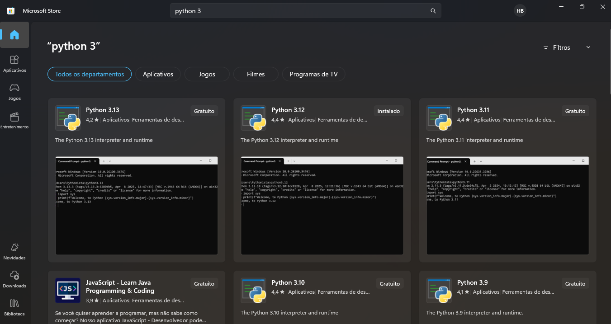
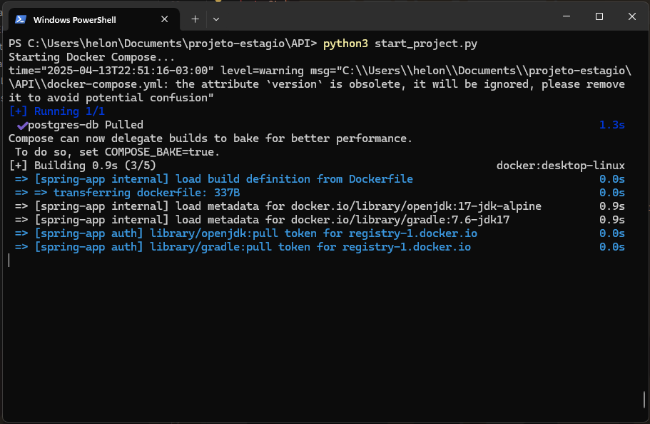
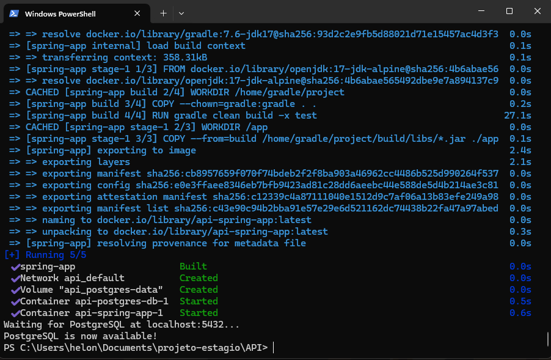

# Desafio Estágio

### Autor

- [Helon Xavier](https://github.com/Helon21)

## Intalação

1. Clone este repositório:
```
Via HTTPS:
  git clone https://github.com/Helon21/Desafio_Estagio.git

SSH:
  git clone git@github.com:Helon21/Desafio_Estagio.git

via github CLI:
  gh repo clone Helon21/Desafio_Estagio
```

2. Abra a pasta Desafio_Estagio em sua IDE favorita:
```
cd API
```

4. Certifique-se de ter python 3 instalado em sua máquina e Docker. Caso não tenha, siga os passos:
```
No Windows é possível instalar pela microsoft store como no exemplo abaixo:


No Ubuntu, mint e debian, use o comando: sudo apt install python3

Para baixar e instalar o docker, acesse o site: https://www.docker.com/get-started/

```

5. Abra o arquivo `.env-example`, renomeie para apenas `.env`, insira as informações do Banco de Dados PostgreSQL.
```
  Caso queira usar as configurações padrões, insira os seguintes dados na .env:
  POSTGRES_USER=postgres
  POSTGRES_PASSWORD=postgres
  POSTGRES_DB=postgres
  POSTGRES_PORT=5432

  Caso seu banco de dados já seja configurado com outra porta, usuário e senha, apenas insira no .env, que será usado pelo docker compose
```

6. Após instalar o python em sua máquina, raiz da pasta `Desafio_Estagio` existe um arquivo chamado `start_project.py`, ele iniciará o projeto com o seguinte comando que deve ser inserido no terminal dentro da pasta raiz:
```
  python3 start_project.py

  Algo semelhante a isso deve aparecer no terminal: 

  O script iniciará o docker file que está configurado com a versão 17 do java alpine, e o gradle 7.6, assim eles são iniciados em um contêiner, para que não seja necessário realizar configurações no ambiente.

  Quando o processo terminar, algo semelhante a isso deve aparecer no terminal: 

```

7. Agora para testar, há duas maneiras, através do Swagger ou de softwares para testar endpoints como Insomnia, ou Postman.
```
  Para acessar através do swagger: http://localhost:8080/docs-desafio-api.html
  Para testar via requisição por insomnia ou postman, importe o arquivo que está na raiz do projeto: Insomnia_2025-04-13.yaml , nesse arquivo contém os endpoints necessários para testar o CRUD de cliente.
```

## Descrição do Projeto

  Este projeto é um CRUD feito em Java 17 com Springboot usando o gerenciador de dependências Gradle, utilizando a arquitetura MVC. O software tem a função de realizar as operações de Create, Read, Update e Delete (CRUD) de uma entidade "Cliente", abaixo seguem as decrições mais detalhadas do projeto:

### 1. **Entidades**

  Este projeto conta com duas entidades, sendo a principal Customer, e a Address sendo um complemento de customer, cuja a função da address é guardar o endereço e associar ao cliente. A customer conta com informações básicas do cliente, simulando um cadastro.

### 2. **DTOs**

  Os DTOs foram criados utilizando Record, para garantir imutabilidade, permitindo apenas operações getter.

### 3. **Repository, Service e Controller**

  A camada Repository está responsável pelas operações do banco de dados
  A camada Service está com a lógica do CRUD e o método de encriptação de senha, e outros métodos auxiliares.
  A camada Controller fica responsável por aplicar a lógica da Service nos endpoints mapeados.

### 4. **Utils, Exception, e migrations**
  A pasta útils está com classes que podem ser úteis em alguma parte do projeto, como formatadores de CPF e Datas, Validações globais, entre outras que poderiam ser adicionadas futuramente mantendo a organização.
  A pasta exception guarda as exceções personalizadas e um exception handler global, assim é possível saber melhor o erro que está ocorrendo.
  a pasta db.migrations, contém os arquivos de migrações, que são como versionamentos do banco de dados, atualmente possui 2 versões, sendo elas uma criação da tabela Customer e uma da tabela Address no banco de dados.

## Infraestrutura

### 5. **Docker Compose e DockerFile**

O DockerFile foi adicionado para que seja possivel realizar o build da imagem da JDK 17 alphine e do Gradle 7.6 evitando instalações locais.
Já o docker compose realiza o build do docker file e inicia um banco de dados postgres. E conecta os dois contêiners através de uma network.

## 6. **Script python**

  A aplicação conta com um script em python para que o processo de inicialização do sistema, ocorra de forma mais fácil, sendo necessário apenas um comando para executar tudo.

## Documentação dos Endpoints

## Customer

### Funcionalidades

1. Cadastrar um novo cliente;
2. Alterar dados de um cliente;
3. Buscar os dados de um cliente através do ID
4. Buscar os dados de todos os clientes
5. Deletar um cliente em específico

### Endpoints

#### Cadastra um novo cliente

```http
  POST /api/v1/customer/create
```
```
{ 
    "name": "Helon2",
	"lastName": "Xavier",
	"email": "helonbentes512@hotmail.com",
	"password": "Helon21",
	"phone": "(44)99974-2469",
	"birthDate": "2001-08-29",
	"cpf": "643.528.070-36",
	"addresses": [
		{
			"street": "Rua da grã betanha",
			"city": "Alemanha",
			"state": "UK",
			"postalCode": "87705-450",
			"country": "Canadá"
		}
	]
}
```
- O cpf precisa ser válido e único.
- A data de nascimento no formato yyyy-MM-dd
- O endereço deve estar entre um array de objetos: { [ ] }
- Status de sucesso: 201 created

#### Alterar dados de um cliente

```http
  PUT /api/v1/customer/update/{id}
```
```
{ 
    "name": "Helon21",
	  "lastName": "Xavier33"
}

  Não é necessário inserir todos os campos, apenas o que você quiser mudar. Mas se quiser mudar tudo, é possível realizar a mudança completa.
```
- O cpf precisa ser válido e único. <br>
- A data de nascimento no formato yyyy-mm-dd
- O endereço deve estar entre um array de objetos: { [ ] }
- Status de sucesso: 201 created

#### Buscar todos os clientes

```http
  GET /api/v1/customer/get-all
```
```
  para esse não é necessário um corpo de requisição, apenas a URL.
```
- Status de sucesso: 200 ok

#### Buscar cliente por id

```http
  GET /api/v1/customer/get-id/{id}
```
```
  Também não é necessário um corpo de requisição, apenas a URL com o ID do customer que você precisa buscar.
```
- Status de sucesso: 200 ok

#### Delete Customer

```http
  GET /api/v1/customer/delete/{id}
```

```
  Também não é necessário um corpo de requisição, apenas a URL com o ID do customer que você deseja excluir.
```
- Status de sucesso: 204 NoContent
